# Public-Key Infrastructure

## Task 1
For the fisrt task we start by copying openssl.cnf file from /usr/lib/ssl/ into the Lab folder, uncommenting the unique_subject line on it and creating the necessary files.

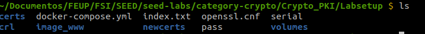

Then a self-signed certificate can be generated for the Certificate Authority.

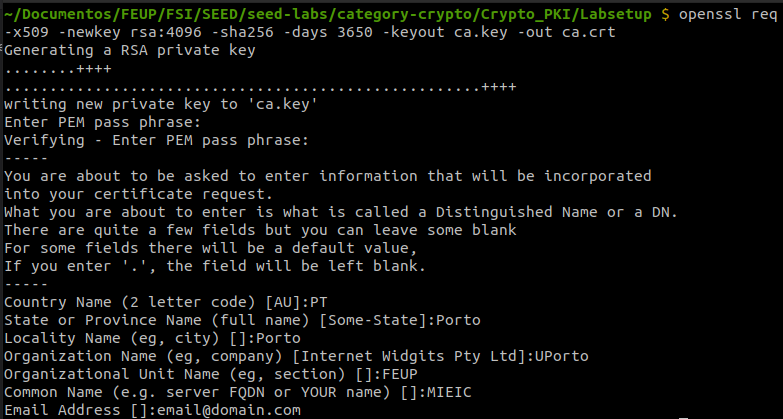

This will create the ca.key and ca.crt files which are the private and public key, in this order

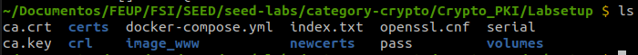

In the certificate file, ca.crt there is a line ```CA:TRUE``` which indicates it's a CA

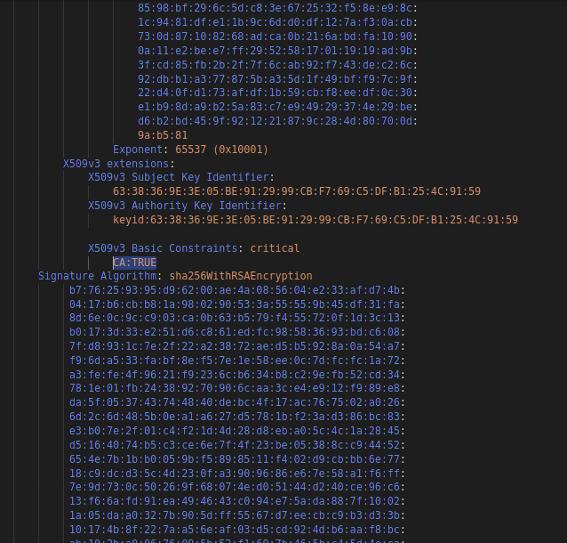

Also in the ca.crt we can see that the issuer and subject are the same, showing that the certificate is self-signed

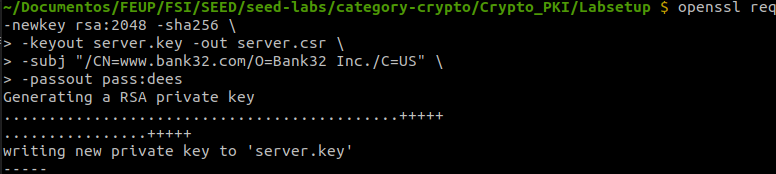

The elements of the RSA algorithm can be found in ca.key and they're labled:
    e = ```65537 (0x10001)```
    
d = 
```
     6e:55:dc:fa:c3:2c:9a:b5:35:b6:a1:e4:7f:ea:71:
    d8:a1:44:c2:87:99:00:cf:53:fe:cc:3c:dc:9a:9c:
    d3:e4:dd:29:ac:16:eb:ad:58:15:a7:54:b9:73:17:
    28:8b:2b:d6:98:8f:a5:f7:e2:b0:20:61:00:61:43:
    de:bb:1d:05:2c:d7:48:83:35:97:64:d6:88:57:28:
    95:0a:b2:ab:c0:1f:b5:e4:0a:c5:b2:34:e5:76:a3:
    be:f9:d6:48:58:2b:e6:0c:68:3a:c3:21:5a:59:6f:
    5b:ec:62:18:28:51:18:59:aa:28:a6:b5:25:fb:35:
    28:e4:dd:00:e0:29:a9:8a:f9:08:3f:63:ce:79:0b:
    30:1b:be:b8:5e:67:22:2a:9c:0e:6d:1d:b3:e5:76:
    8c:e7:d9:39:56:10:98:8e:f4:54:16:54:f9:e8:c0:
    17:bd:d3:9e:3e:43:bd:dc:b6:a4:da:3d:82:91:f0:
    96:53:92:dc:6c:ec:3b:b8:2a:18:e1:f2:f3:a5:d2:
    f4:39:df:73:2d:0a:a2:67:26:42:c0:0f:78:2f:d9:
    dd:5b:d8:8d:93:42:f8:ba:0e:94:46:45:99:20:f6:
    ce:55:c3:43:f8:e0:f9:f2:bc:9a:89:0d:ff:76:f6:
    ff:34:88:63:17:25:01:71:b4:49:8d:b2:03:de:d9:
    db:98:13:50:01:05:bb:16:81:a8:28:e8:80:cd:8a:
    e4:cf:1a:5d:2f:75:d8:e1:09:d0:9d:20:58:78:fc:
    ec:06:a1:35:2f:ad:e1:c3:1d:b8:81:0c:8e:68:01:
    1b:10:2f:6c:ce:9e:d3:ab:ac:e8:5b:55:c5:24:d5:
    17:30:66:14:e9:2c:0e:ee:0e:e8:0a:6f:5f:03:9b:
    9a:9e:23:44:82:0c:2b:78:9b:d5:58:84:58:b7:a4:
    b7:c5:a3:d8:db:c3:f8:22:24:ec:33:f9:b3:c5:4e:
    08:a7:f7:e9:32:10:87:5c:21:b3:be:41:2e:37:6c:
    09:ea:fd:2f:23:a7:cb:10:7e:d2:e5:15:59:3f:e1:
    0c:71:2b:ea:a8:89:82:56:33:01:87:12:10:81:71:
    02:7f:2e:83:18:54:fa:a3:91:a0:12:5c:38:37:8c:
    62:c6:62:59:5e:42:d9:46:04:8a:4c:a4:17:e5:30:
    3f:80:2e:21:40:8a:29:28:8a:e9:fa:e3:15:bf:c8:
    06:98:ea:11:8d:cf:1d:72:2c:ec:9f:b7:55:c3:fd:
    6a:8e:42:41:34:6d:00:be:3a:36:41:8b:99:e7:5f:
    c6:03:c1:0a:1c:f1:b0:23:b0:a6:e2:fe:d9:6f:96:
    ea:38:51:66:c5:16:1b:5e:a8:68:5e:0d:fd:9d:96:
    4f:a5
    
```
n =
```
00:c5:4e:38:e7:da:71:77:6c:a4:bc:ca:f4:97:83:
    e6:49:be:4e:9c:1f:11:1c:0c:3e:60:ea:00:53:c3:
    3d:28:a8:9a:0e:13:b0:3a:42:1e:bd:e5:26:ce:e2:
    c9:04:5e:38:05:01:12:08:4f:21:fb:a6:11:10:28:
    99:81:a1:84:44:37:61:b9:a6:0f:3b:5e:bd:52:18:
    3e:ba:75:1c:90:c7:cc:e9:14:73:44:86:45:f9:ab:
    0d:fd:17:5c:3a:05:a8:e1:e0:02:82:44:ea:a8:18:
    d2:c4:36:46:66:84:76:38:cf:0e:f1:8a:2c:2a:46:
    dd:9c:d6:a7:6b:47:94:b8:30:94:38:5c:02:5c:2b:
    1f:c8:9d:2f:b7:72:1d:0c:62:08:18:98:95:d3:46:
    68:23:40:01:92:ad:49:b8:10:3d:61:0c:bd:cd:97:
    cf:1b:6e:25:17:81:1b:67:5c:e9:d8:d1:bd:5a:60:
    a0:8c:a0:78:d0:d3:d9:eb:d7:f2:17:c3:90:22:ee:
    6c:28:af:ff:15:d5:06:9c:70:4c:67:3a:b2:b2:5a:
    dd:16:ea:96:fc:d9:2f:e9:4a:97:05:a1:07:4f:2e:
    55:0f:88:33:88:ea:e7:85:d0:2b:58:4f:b0:d1:d0:
    4e:f2:9e:be:10:70:9a:11:bf:50:b8:fb:44:9c:c8:
    11:58:e2:c2:60:23:f8:8d:c5:16:ad:11:9e:91:9e:
    53:3e:a6:36:fb:53:64:ad:1c:0e:bb:eb:57:6c:83:
    7a:8c:f4:57:72:1f:c9:f2:e1:db:3b:5c:ed:af:04:
    7b:88:d4:48:e2:37:b2:24:3d:67:36:3c:70:cf:fe:
    42:ae:ea:1b:ab:21:b9:19:43:d9:6c:bc:f7:3d:9d:
    37:33:2c:eb:e3:f2:06:45:8d:b8:61:cb:8f:f8:c1:
    ae:8a:92:65:cb:3a:e1:92:4e:47:06:c3:cc:bd:3a:
    f5:2d:47:d6:53:b8:d3:39:70:1d:fb:3c:c1:ba:52:
    85:98:bf:29:6c:5d:c8:3e:67:25:32:f5:8e:e9:8c:
    1c:94:81:df:e1:1b:9c:6d:d0:df:12:7a:f3:0a:cb:
    73:0d:87:10:82:68:ad:ca:0b:21:6a:bd:fa:10:90:
    0a:11:e2:be:e7:ff:29:52:58:17:01:19:19:ad:9b:
    3f:cd:85:fb:2b:2f:7f:6c:ab:92:f7:43:de:c2:6c:
    92:db:b1:a3:77:87:5b:a3:5d:1f:49:bf:f9:7c:9f:
    22:d4:0f:d1:73:af:df:1b:59:cb:f8:ee:df:0c:30:
    e1:b9:8d:a9:b2:5a:83:c7:e9:49:29:37:4e:29:be:
    d6:b2:bd:45:9f:92:12:21:87:9c:28:4d:80:70:0d:
    9a:b5:81
```
p =
```
 00:f0:e4:db:bf:7b:fd:f8:ad:57:36:d0:53:d7:1a:
    58:e3:05:be:1c:97:9d:d4:be:81:46:6d:43:9d:ed:
    b1:9c:08:4a:cd:95:b7:5f:76:92:f4:c9:db:fd:ea:
    0d:e2:5c:59:89:af:f0:53:37:b3:96:e6:5f:33:7c:
    a1:0b:fb:19:b4:4e:d8:51:4a:62:65:2c:48:23:95:
    01:72:1b:bb:31:0c:ec:c2:44:3f:3d:55:c0:07:92:
    70:7e:ae:e9:0e:55:ad:7e:d7:bf:1a:15:98:05:14:
    33:02:e6:c7:ae:6f:1b:f3:6e:a9:77:9a:4e:ef:d1:
    34:e0:64:27:a0:9e:5e:71:58:93:23:aa:92:a7:ea:
    09:e8:de:0f:e9:eb:55:01:34:db:cf:22:dd:19:0e:
    cc:92:7a:11:b6:05:ad:d6:f8:a5:92:18:e4:c8:dc:
    f0:cd:18:bc:4c:2a:1a:74:26:e5:63:fa:4b:b7:15:
    a9:28:76:fe:06:26:1b:38:58:fa:7d:e9:c7:7e:c6:
    42:a8:24:84:fc:18:5c:ff:d4:b3:7e:a0:3e:a5:13:
    5f:ae:71:66:a2:7f:78:e5:cd:1b:f7:2a:c5:71:88:
    77:6e:f2:62:36:9e:cf:13:6f:5f:21:bd:ce:d5:f0:
    b7:98:00:e7:34:a0:fc:91:30:dc:7a:e0:a4:d4:fb:
    5b:3f
```
q = 
```
00:d1:ad:a0:4d:90:23:f2:12:04:13:41:58:5e:d8:
    43:13:db:25:0b:eb:32:c8:f9:79:bc:1b:14:6d:81:
    d0:2a:30:fe:2c:14:13:9a:5e:b5:88:97:b9:ee:53:
    7c:7c:98:ef:6e:73:f6:22:62:63:e3:a1:96:0d:c7:
    e7:b4:46:ef:7e:be:d9:bd:97:5b:eb:a6:fd:31:a3:
    d3:c4:50:53:68:fd:aa:c4:75:98:5f:4a:05:3b:77:
    21:3f:90:23:e2:e7:22:8d:31:9c:c0:0c:36:73:29:
    44:7e:6b:7a:1d:e5:48:40:b2:16:1f:bb:3c:94:a3:
    d3:6c:63:32:15:26:40:61:b1:78:5c:79:ee:89:c3:
    e1:3f:52:62:ad:a8:1b:9d:41:e6:13:57:ec:ae:a4:
    da:67:93:e3:81:e8:14:a7:ea:77:01:de:5f:76:88:
    fd:37:9d:ff:f0:93:a9:e9:14:8f:cb:02:eb:c6:de:
    25:3a:7c:fa:89:03:dd:10:a6:ae:20:e3:be:48:d3:
    20:55:62:a0:50:b5:53:c0:c3:c8:01:9a:23:58:d5:
    85:cd:be:a2:55:b7:b9:3a:ed:4a:c3:2d:36:f6:0b:
    7f:1a:9b:c0:1c:e1:f7:c1:ca:6e:92:e4:d6:80:a6:
    26:d9:a9:d8:14:d1:60:46:81:7c:e9:51:09:c6:c5:
    7f:3f
```

## Task 2

In this second task the goal is to create a public key for a web service in the CA. 

That can be acomplished by creating a Certificate Signing Request as following:

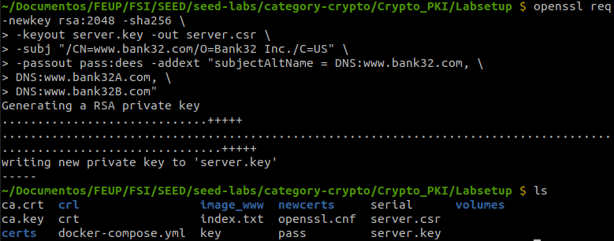

The addText flag is used to alternative names for the CSR

## Task 3

In the third task we will create a certificate for the server, by first turning the certificate from the last task into a x509 certificate using the ca key and crt.

First we will uncomment the copy_extensions line in the openssl.cnf file:

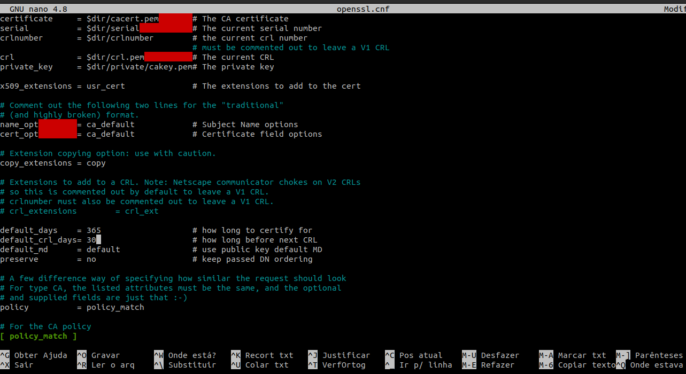

Then run the command to create the certificate

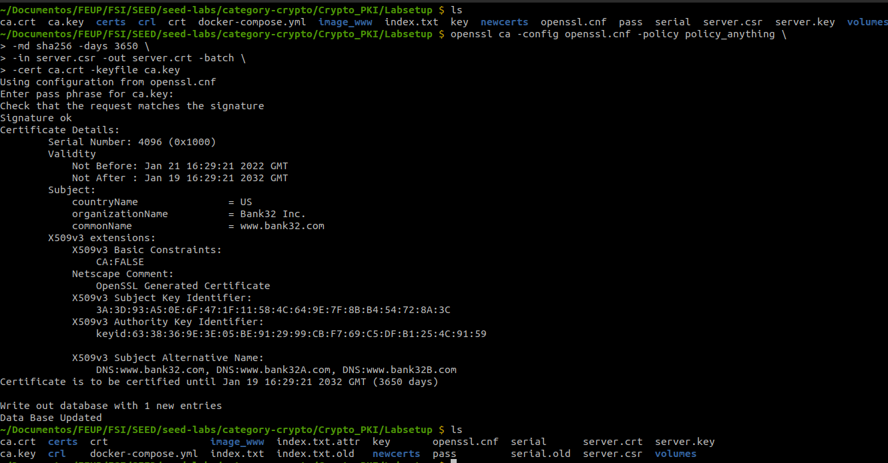

Now we can see the certificate, where we can see that the alternative names are included from the line ```X509v3 Subject Alternative Name: DNS:www.bank32.com, DNS:www.bank32A.com, DNS:www.bank32B.com```

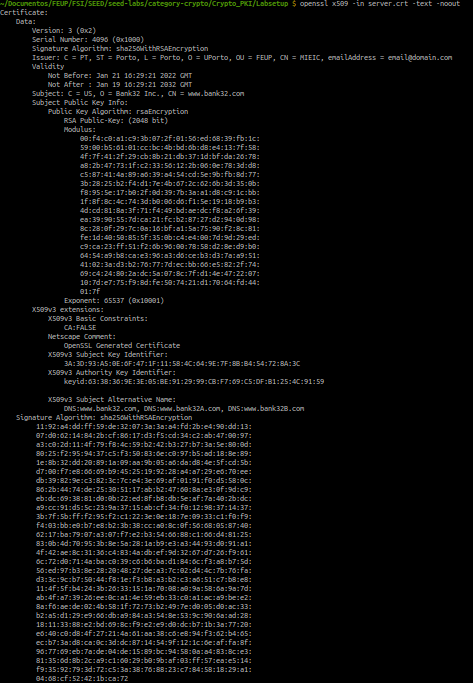

## Task 4

Now to deploy the site we just need to start the docker, connect to it via ssh, making sure that the server.key and server.crt are coppied into the certs folder, because the docker when start moves the certificates in the certs folder from the Labsetup into the certs folder of the docker.

Also the server key and crt must be renamed to bank32 key and crt in order to work with the docker without changing any file. 

But if wanted a file can be created into /etc/apache2/sites-available with a different index.html to emulate a different site.

Inside the docker we can run ```service apache2 start``` to start the server and access the site.

When we try to access the site through https the browser blocks it because it doesn't know the Certificate Authority since it's our own not one of the known CAs that the browser accepts.

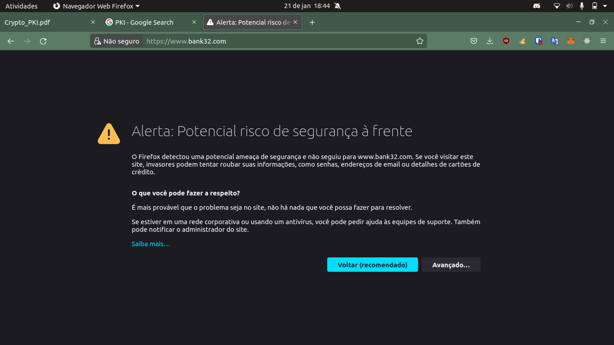

To solve that we can go into the browser settings and import the ca.crt file to the trusted authorites.

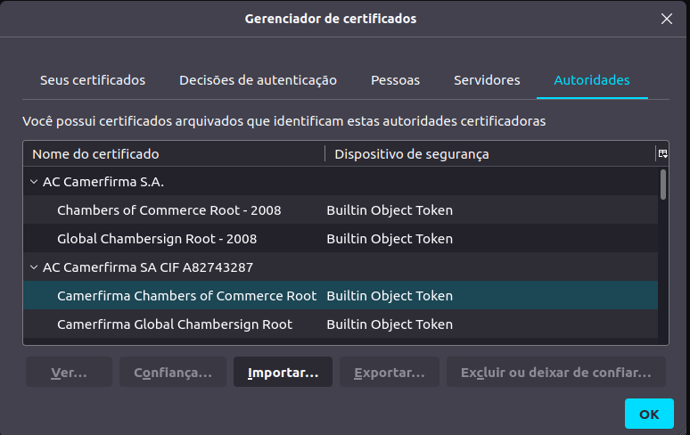

Now we can access the site correctly

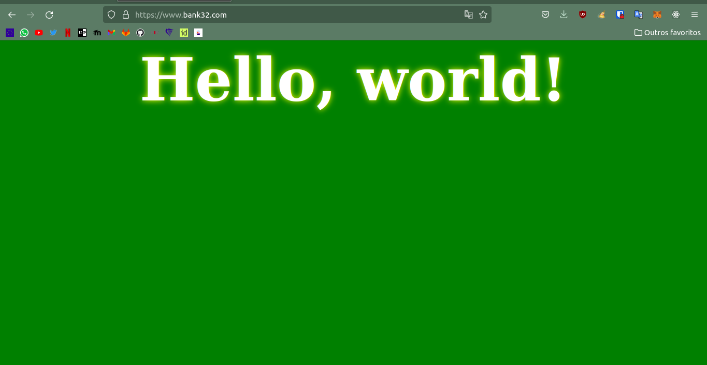


## Task 5
To try a Man-in-the-Middle pretending to be feup's sigarra attack we create a sigarra_apache_ssl.conf file like this:

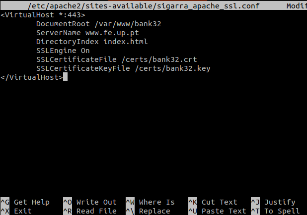

And then edit the /etc/hosts file in the host machine to redirect www.fe.up.pt to the server address

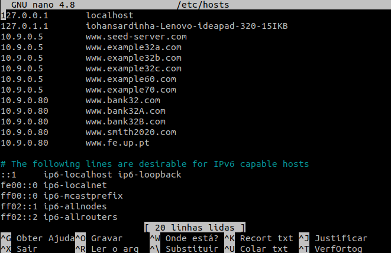

But when we try to access the site, it does redirect to the server, but the browser notices that the certificated is not valid for fe.up.pt only fot the bank32 and alternative names

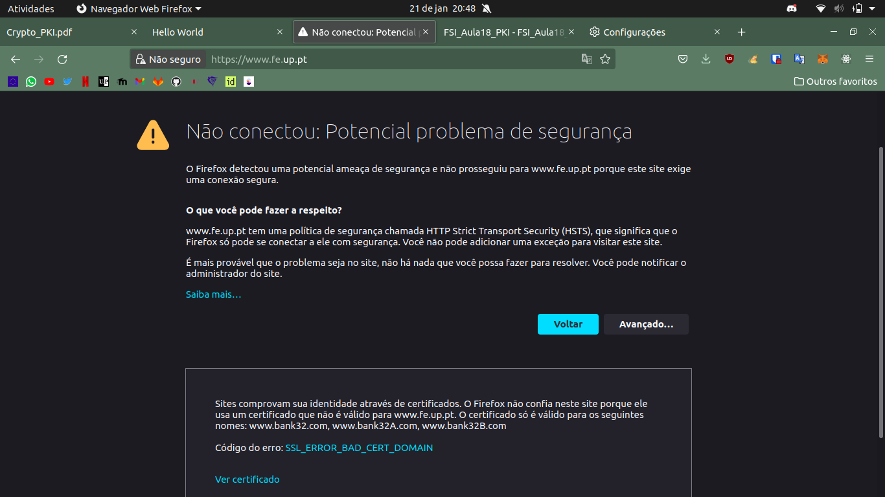

## Task 6

Finally to make the browser accept the site we need to either create a new certificate with the site address on it, which can only be done with access to the CA key.

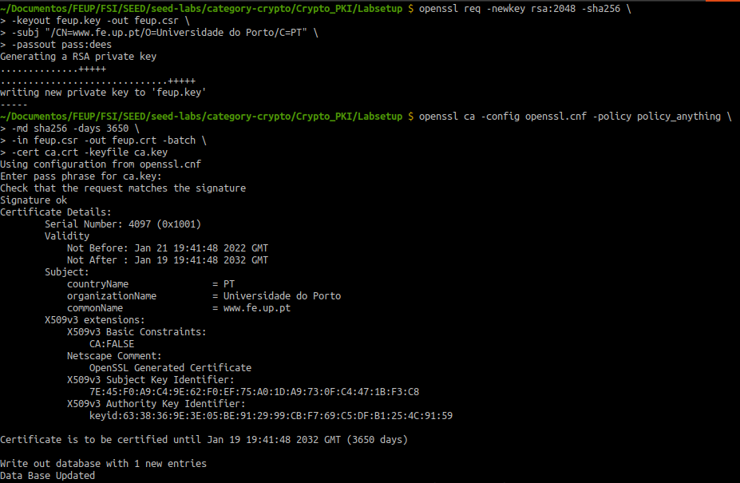

Now we have to add this certificate to the apache config

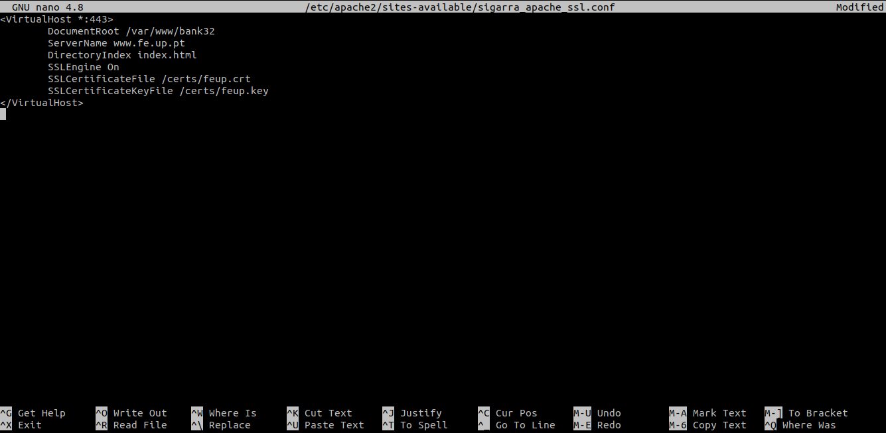

Now we can access the site
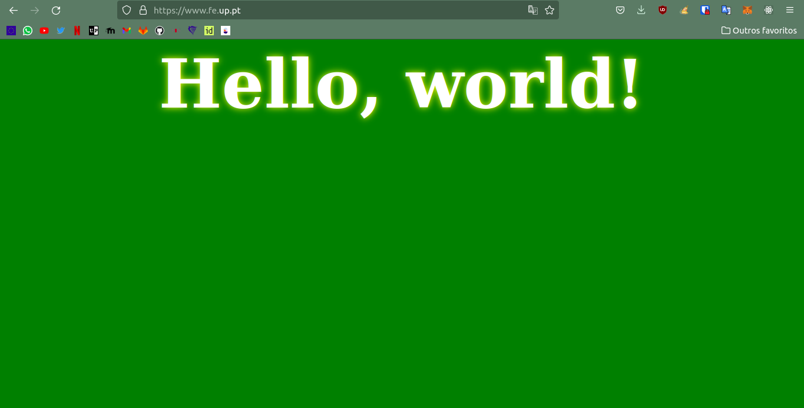