# Tasks about Environment Variables

## Task 1

In this first task, using the commands ``printenv`` and ``env``, we were able to see the full list of environment variables. The following printscreen shows the result of that:


Then, using the commands ``export`` and ``unset``, we were able to both update an existing environment variable (*LOGNAME* in this case) and to delete an existing one right after (again, *LOGNAME*). The following two printscreens show these actions:


## Task 2

In this second task, after allowing the VM to access local files using a shared folder, by running the command ``gcc myprintenv.c`` followed by ``a.out > output``, the file *output* was written with all the environment variables shown in the first task after running the command ``printenv``.

Even after switching the commented line of child and parent processes, the content of the second file, *output2*, was the same (which was verified using the ``diff`` command), meaning that the child processes have access to the same environment variables the parent processes have.

This could result in a security failure that can be used by intruders to an unauthorized / unintended access to environment variables.

The following picture represents the sequence of commands used during this task:

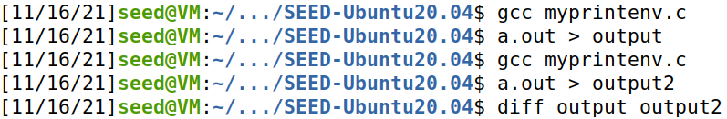

## Task 3

In this third task, we compiled and ran the **myenv.c** program, by running the following commands: 

```console
gcc myenv.c
./a.out
```

With the first version of the program, when running it, the console doesn't print anything.

After changing ``NULL`` to ``environ`` in the code and compiling and running the program again, the console printed the environment variables.

With this results, we know the environment variables are not inherited in the program. In the second part of this task, the program gets them by external pointer ``environ``.

The following pictures represent the commands used during this task and the results we got:

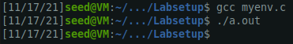
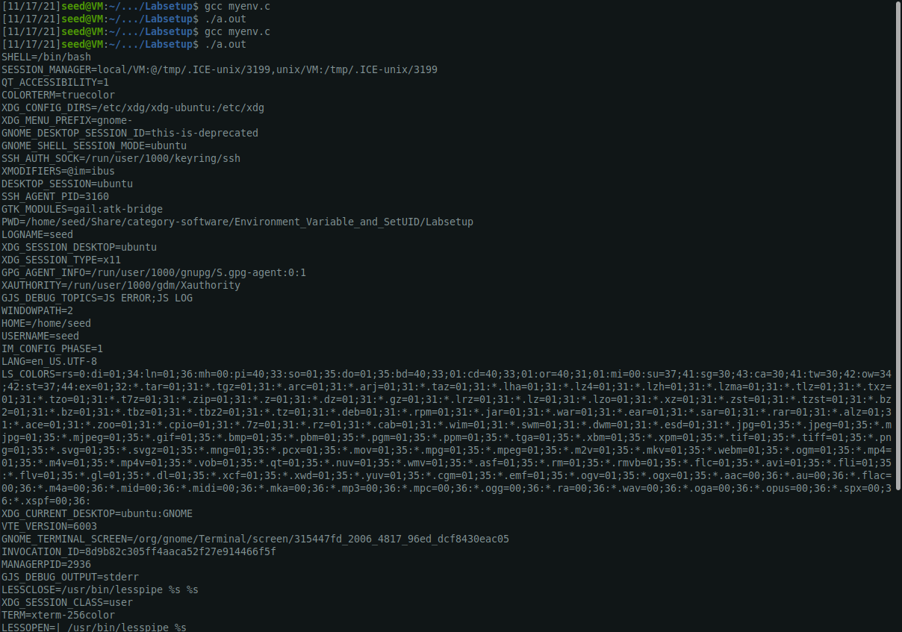
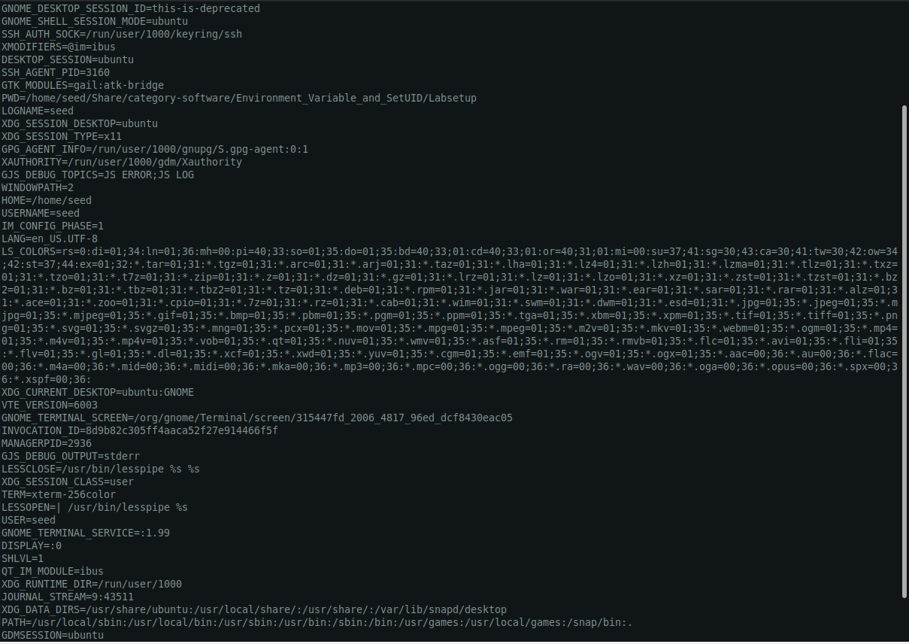

## Task 4

In this fourth task, we compiled and ran the given program as documented in the seed lab tutorial, by running the following commands:

```console
gcc system.c
./a.out
```

When running, the program prints all environment variables that are in ``/usr/bin/env``.
This means that the ``system()`` function has passed the environment variables to ``/bin/sh``.

The following pictures represent the commands used during this task and the results we got:

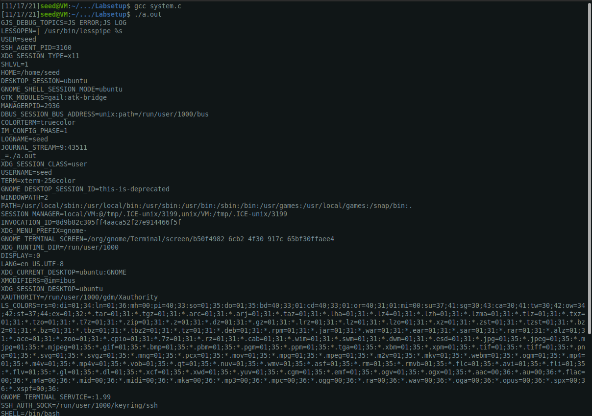
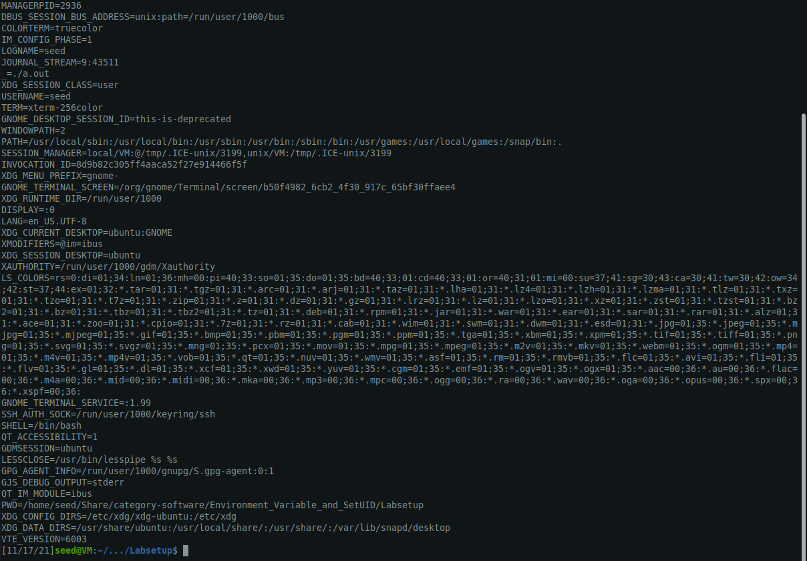

## Task 5

When we run the set-uid the LD_LIBRARY_PATH environment variable is missing, although all the other ones are present.
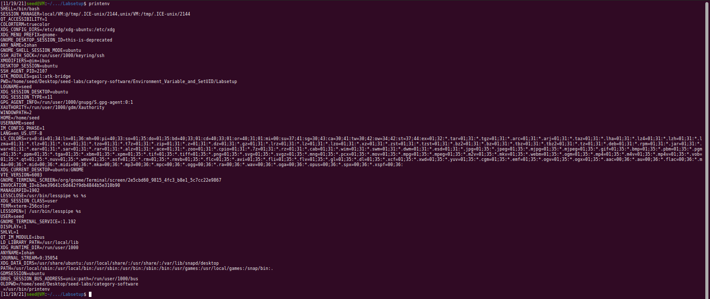
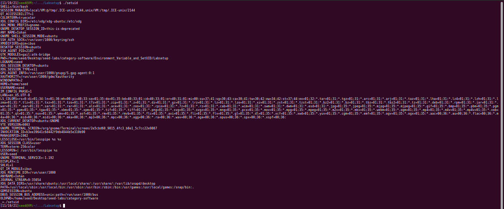


That happens because LD_LIBRARY_PATH tells the dynamic link loader the path to linked libraries, so for security reasons this environment variable is ignored in order not to execute programs that were not supposed to be executed by the root user and may be linked in the libraries.

## Task 6

If a directory is added to PATH in which there's a file called *ls* the file will be executed instead of /bin/ls, ig the abosulute path is not given, and since the program has root privileges this program will be executed with this privileges and can do harm.

In this case a program that just prints "I'm not ls..." was crated and addes to /home/seed and the result was the following


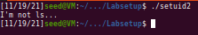


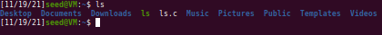

# CTF Challenge
Firstly we navigated through the given website (http://ctf-fsi.fe.up.pt:5001) and took notes of everything relevant to us.
With this we found that:
- The website was made using Worpress (version 5.8.1)
- The website was developed using Storefront and WooCommerce
- There is one account with the username "admin" and another with the username "Orval Sanford"
- JQMigrate is installed (version 3.3.2)
- WooCommerce plugin is installed (version 5.4.1)
- Booster for WooCommerce plugin is installed (version 5.4.3)

Then, by doing some research, we found that the CVE-2021-34646 could be an useful exploit for us.
This exploit allows us to get access to an account through a token generated when the user clicks on the button to reset his password.

By running a python script that we found, we then got access to the admin's account and got the flag we needed as we can see in the screenshots below.

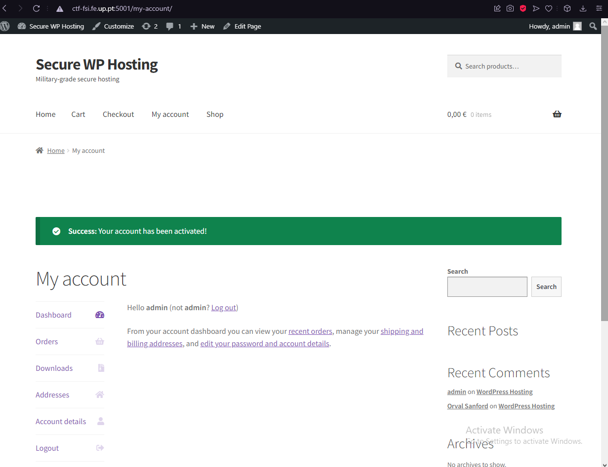

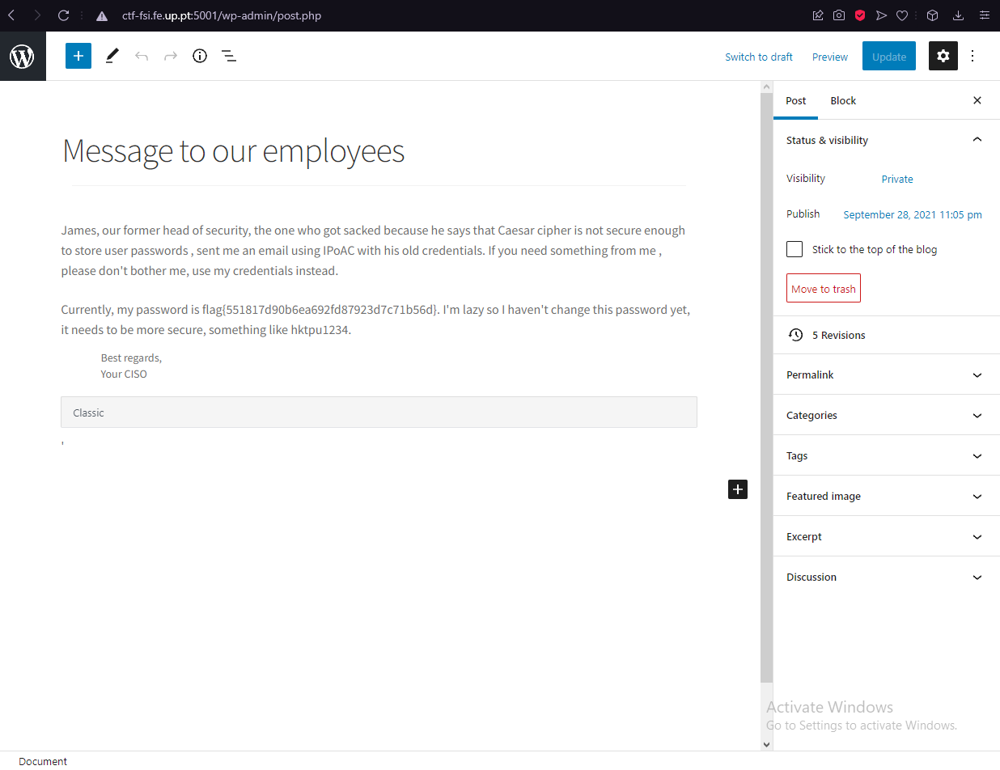

