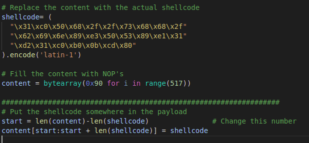
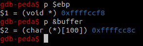
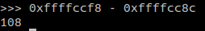
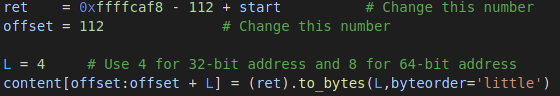
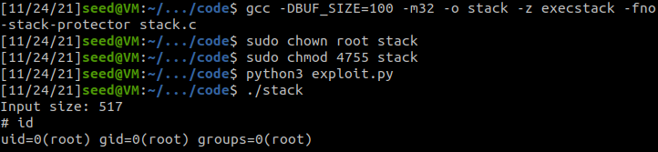
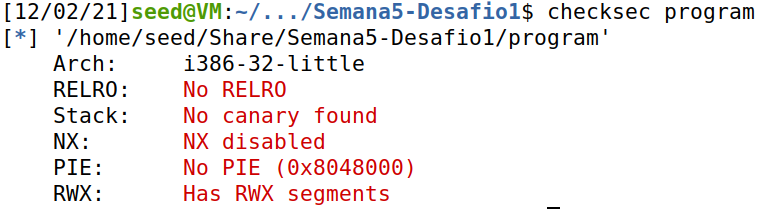
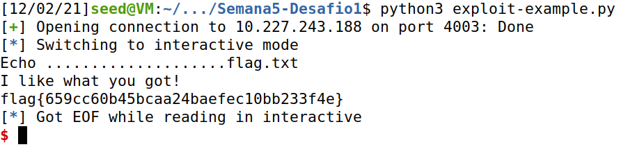
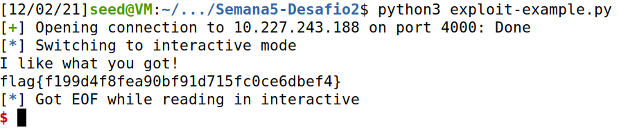

# Buffer Overflow Tasks

## Task 1
When either the *a32.out* or the *a64.out* files are executed the result is that the zsh shell program is started, in the same way as if */bin/sh* was directly called by a shell, due to the execution of the *execve* command.
In that way an assembly code could be written with any shell command instead of "/bin/sh" and transformed into binary, so to be called by the given program, in order to do a real code-injection attack.

## Task 2
This task is just an explanatio of the vulnerable program, which contains a *strcopy* call that writes a string into a buffer bigger then the buffer size. This will allow code injection by inserting malicious code in the stack overflown space, the space after the end of the buffer.

Also it explains how to compile the code turning of the operating system protections and how to give the program root privileges.

## Task 3
The goal of the program is to write in the stack some shell code and rewrite stack return pointer to the address of this code.

The badfile will be copied into the buffer, and override the stack after it to a limit of 417 bytes(517 bytes of the variable *str* minus 100 bytes of the buffer).

The file be all NOP's by default, then some values must be known:
* Where to insert the shell code
* Where is located the return pointer
* The address to overrinde the return pointer

So the first 100 Bytes in the stack will be the buffer(which could have any value, will be NOP's), then will be the ebp, and the return pointer, followed by NOP's in case the return pointer address is off by some bytes that can happen since the address is obtaindes via gdb which ommits some values from the stack, and finally in the end of the file will be the shell code.

The place where to insert the shell code is basically the size of the badfile minus the size of the shell code:


The location of the return pointer is found by finding the distance between the ebp and the buffer addresses:



Then by adding 4 to the calculated 108 giving 112, bacause the size of each element in the stack is 4 and the return pointer is located right above the ebp

The address to be overriten is the address of the buffer plus the location of the shell code(or the location of the ebp - 112 since thats the distance to the buffer location)


Then finally by running the code that reads the badfile a shell will be open with root privileges


# CTF Challenge

## Part 1

After installing the python library ```pwntools``` and the ```checksec``` package, we ran the following command

```console
$ checksec program 
```

and obtained the following result:



Considering this was the expected result, what followed was the source code analysis. That concluded, we got to know the following:

- There's a file 'mem.txt' that is being open and read.
- Since the 'buffer' has only capacity for 20 bytes and that the following code snippet ```scanf("%28s", &buffer);``` gets 28 bytes from the user input, we know we have a buffer overflow attack possibility.

That said, the first 20 bytes introduced can be random, but the last 8 are specially important, because those are the ones that will allow us to change the 'meme_file' variable to point to the 'flag.txt' file instead of the 'mem.txt' file.

By updating the 'exploit-example.py' script so that the 12th line could be something like:

```python
r.sendline(b"....................flag.txt")
```

We made sure that the variable meme_file was now pointing to the 'flag.txt' file instead of the original 'mem.txt' file, giving us the flag we were searching for by running the script:



*Note: We also had to change the address from 'ctf-fsi.fe.up.pt' to '10.227.243.188' in order to run the python script inside the VM without needing to establish a new VPN connection (which was already established in the Windows machine).*

But the main question is: why did the above line changed all? Well, as we saw after running ```$ checksec program ```, the positions of the binary were not randomized and there are memory spaces with reading, writting and execution permissions, in this case, the stack itself. That said, analysing the source code, we can easily conclude that the 'meme_file' address is right next to the 'buffer' one, which allows us to use those 8 "extra" bytes to update the 'meme_file' variable value.

## Part 2

We started the same way as in Part 1, with the ```$ checksec program``` command and obtaining the exact same result, which we'll not include here since it's the same as above.

We've used the same structure for the python script, but making some changes. But before, let's analyse the new source code.

We can conclude that it's similar to the first one, but has a difference that makes the previous script unsufficient.

This time, the lines of code in which the file is open are inside a condition, which only becomes true for a certain value of the 'val' variable. Also, the buffer keeps its capacity of 20 bytes, but the ``scanf`` now reads 32 bytes and not just 28. That means that we can use this new 4 "extra" bytes to update the value of the variable 'val', which has 4 bytes, actually, and then have the condition verified.

There's also another important difference. This time, the address of 'meme_file' variable is not next to the 'buffer' variable, but instead, is next to the 'val' one. And this last one is the one that it's next to the 'buffer'. So, that means the 20 first bytes are again irrelevant, but the ones from 21st to 24th are for the update of 'val' value and the ones from 25th to 32nd are for the 'meme_file' value. 

That means we must use those 4 new bytes to insert the value that makes the condition true. Although it might look simple enough, we must consider the following:

- The bytes must be in hexadecimal
- The order must be inverse

That said, we changed the python 12th line to

```python
r.sendline(b"....................\x22\x21\xfc\xfeflag.txt")
```

and, by running the script, we found our second flag:



