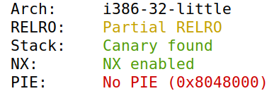
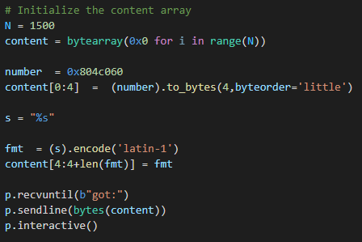

# Format String

## Task 1
On the first task it's asked to send a string to the vulnerable code running on the server. For that the *build_string.py* program is used, to create a 1500 characters long string, which is the known size of the string used in myprintf(). In the start of the string some "%s" is inserted, that should make the program look for strings in the next memory spaces. Sometimes the code may find some random memory and interpret it as the strings it's looking for, that's why more then just one "%s" is inserted.


## Task 2
### Task 2.A
For every *%x* the printf will move 4 Bytes in the stack and print them, starting from the address above the string untill it reaches the buffer and start's printing the values in the buffer.
If a 4 Byte tag is put in the beggining of the string followed by a very large number of *%x* its possible to look for the tag, the group've put "AAAA" which is 0x41414141, then count the number of addresses before it. In this exemple the number necessary to print the first 4 Bytes was 64 *%x*


### Task 2.B
To print the message located in the given address a "%s" is inserted in the end of 63 *%x* and the address in the beggining of the string. 
So when the printf is called it will move it's pointer to the start of the buffer with the *%x*, then the *%s* will make the pointer move 4 Bytes and print the string located in the address the pointer is pointing to. 
Since the beggining of the buffer is the address of the hidden message it's gonna be printed.
The hidden is "A secret message"


## Task 3
## Task 3.A

For this task, we've used as the base the code of the above task, but with a slightly different version.

The first 4 bytes aren't the string 'AAAA' anymore, but the address of the target variable, as it's said in the server printout (0x080e5068).

Then, we do not introduce 64 %x, but only 63 so that the last one can become a %n, which will insert the whole value inserted until there into the address of the first 4 bytes.

That means that, with the 4 initial bytes plus the 63 x 8 bytes we get 508 bytes, which is the same as 0x1FC in hex, what we can comprove with the new target variable's value.


## Task 3.B

The second part of this 3rd task is similar to the first, but it's different in the way that we have to make sure the sum is not 0x1FC, but 0X5000. 

That said, 0x5000 is 20480 in hex. Since we need to have y times %x, and considering the first 4 bytes as the target variable's address, we get the following:

20480-(y*8+4)=z

Where z will be the value to introduce between the y %x and the %n. By reducing the number from the previous sub-task in 1 unit, instead of 63 %x we now have 62 (value of y) and the result (value of z) is now 19980, which was the value we inserted on the code, obtaining the desired result, as the following two pictures show.

2048-(62*8+4)=19980


# CTF

# Challenge 1

The first thing we did was to run ```checksec program``` and we obtained the following result:



By analysing the output, we get to know that:

- The architecture of the file is x86 (Arch)
- THe RELRO is partial, which means the program is not really effective in preventing GOT (Global Offset Table) overwrite attacks
- There is a canary protecting the return address (Stack)
- The stack doesn't have permission to execute (NX)
- The binary positions are not randomized (PIE)

We then analysed the code and saw that the following line

```c
printf(buffer);
```

contains a vulnerability, since it uses the ```printf``` c function to print the content of the 'buffer' variable, which allows us to perform a Format String Attack by accessing the content of the 'flag' global variable.

To start, we ran the exploit one first time, with the default configurations, running then the command ```gdb attach 7364```, followed by the 

```console
p &flag
```

cmd to get the address of the 'flag' global variable, as the following screenshot shows.


Having this value, all we need to do was to change the exploit to create a formated string to read the value of a variable for which we know the address.

To do so, the first 4 bytes were written with the variable's address and the following one was the ```%s``` to read to a string that variable's value.

The following print contains the code we've used and the next one the result of executing the exploit and obtaining the flag we wanted.




## Challenge 2

The first thing we did in this part was the same we did in the previous one, i.e. run the ```checksec program``` cmd.

The result was the same as above, so we'll not include the analysis of it since it would be redundant.

This time, after analysing the code, we get to know that the flag.txt content, which contains the flag, isn't uploaded to memory, but there's a possibility to access the content of this file.

To do so, we need to enter on the if condition that checks the 'key' value against the 0xbeef hex value.

Again, we have the ```printf(buffer)``` that prints the input from the user, so we'll use it again to perform a Format String Attack.

Before moving to the code itself, we made the same procedure as above to obtain the address of the key variable, which was the one we needed to make sure we could update from 0 to 0xbeef to enter on the if condition.

We ran ```gdb attach 7373```, after knowing the PID, followed by 

```console
p &key
```

obtaining the following result:


Then, all we need to do was to write first a dummy address (we selected 0x1845d054 randomly) and then the variable's address (0x0804c034), followed by the number of bytes needed (i.e. equal to decimal value of 0xbeef minus 8, with 8 being the number of bytes used for both addresses written before) and ending with a '%n'.

The reason for this (using a dummy address) was that by just writing the address of the 'key' variable and then the int representation of 0xbeef wouldn't work since the %n writes in the variable the number of characters that were printed on the console and not the number that was just inserted as an int. That way, the dummy address works as the "intermediary" to make this possible.

The next screenshots show our code and the result after running the exploit and running the cmd ```cat flag.txt```, which allowed us to obtain the flag. 


