# SQL Injection Attack

## Task 1
The first task is pretty straightforward, just connecting to the mySQL database and executing a simple query to print the information of the employee Alice:
```SQL
SELECT * FROM credential WHERE Name = 'Alice';
``` 
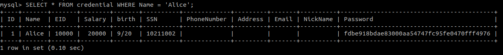

## Task2
### Task 2.1
In this task the goal is to use SQL Injection to log in as administrator, an insecure query to log-in would probably be similar to:

```SQL
SELECT (fields...) FROM credentials WHERE Username="$username" AND PASSWORD = "$password_hash";
```
In order to alter the code it's possible insert a *#*, which represents the start of a comment, after the username so the resulting query would look like:

```SQL
SELECT (fields...) FROM credentials WHERE Username="admin";# AND PASSWORD = "$password_hash";
```

This way it's possible to access the data exclusive to the admin, and also access any user that the attacker knows the username.

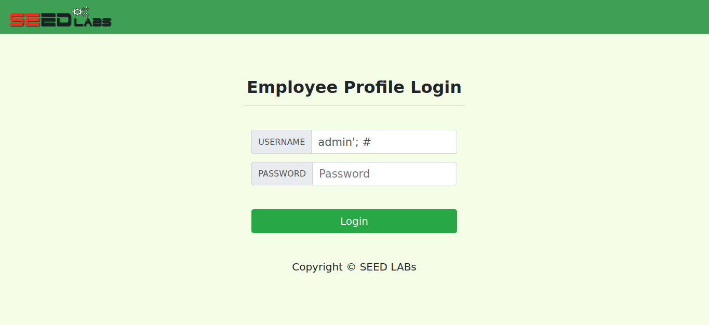

### Task 2.2

To do the same task through the command line it's possible to use the curl command which does an http request to the given url. But to so the special characters must be enconded, in this case the single quote will be %27 and the hashtag will be %23 so the full command will be:
```bash
curl 'www.seed-server.com/unsafe_home.php?username=admin%23%27password='
```  
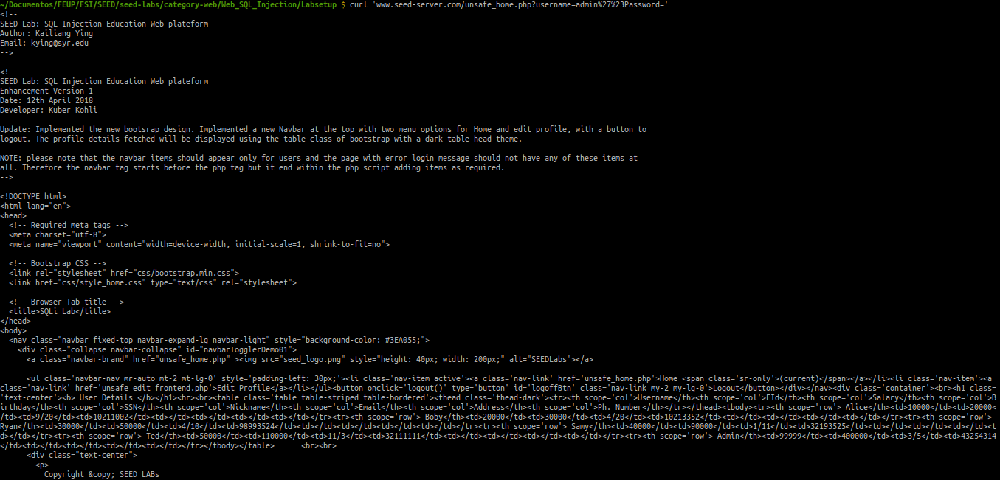

### Taks 2.3
The countermeasure preventing the insertion of two statements is the use of *pdo::query()* php function which does not admit multiple statements.

So if the attacker tries to run some code like:

```SQL
admin'; INSERT INTO credentials(Username, EId, Salary, Birthday, SSN, Password) VALUES("badUser", 6000, 999999, 1/1, 123456);#
```

They will get an error

## Task 3
### Task 3.A
We can take advantage of the Edit Profile page to change Alice's salary.
Firstly we need to enter Alice's account.
Then we go to the Edit Profile page and add the following code into the Phone's input field (as shown in the screenshot):
``` SQL
', Salary='99999
```
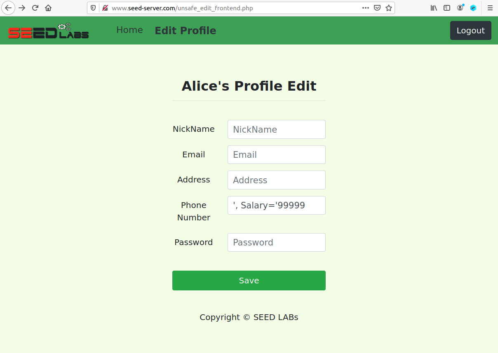

After we save our changes, we will see the following result:
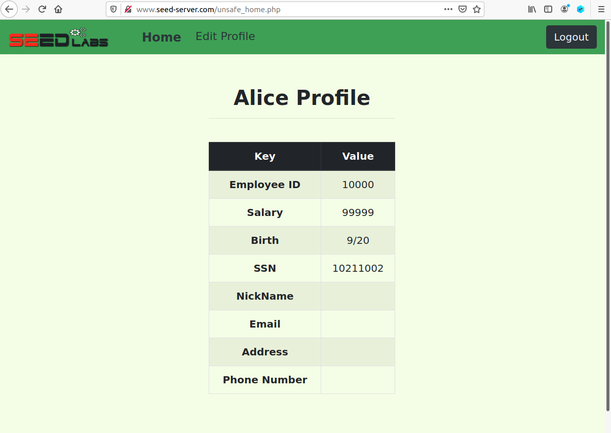

### Task 3.B
We can take advantage of the Edit Profile page to change Boby's salary.
Firstly we need to enter Alice's account.
Then we go to the Edit Profile page and add the following code into the Phone's input field (as shown in the screenshot):
``` SQL
', salary=1 WHERE name='Boby' #
```
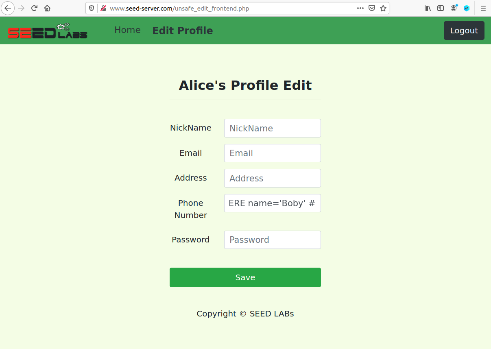

After we save our changes, we login as Boby and we will see the following result:
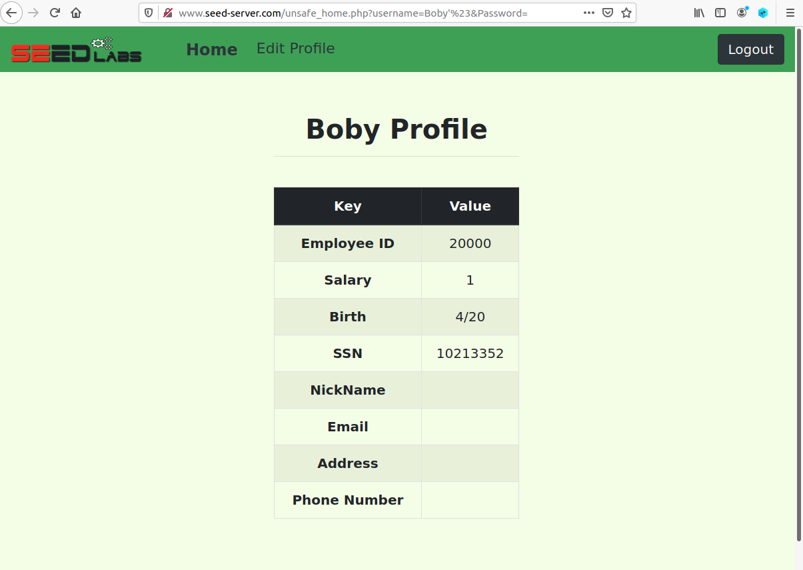

# CTF

# Challenge 1

Starting by analysing the code, on the following line there's a SQL Injection vulnerability that allow us to login with any account, knowing the username and ignoring the password.

```PHP
$query = "SELECT username FROM user WHERE username = '".$username."' AND password = '".$password."'";
```

To do that, we just need to make sure we insert the username of the user we want to login as and, in the same input field, close the SQL script (with ```';```) and ignore the rest (with the comment char ```#```). That was what we did, by typing this on the username:

```
admin'; #
```

Then, the password can be any, except an empty field. We wrote '123' and then, by logging in, we got the first flag.

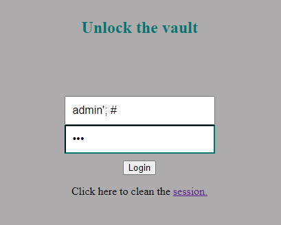

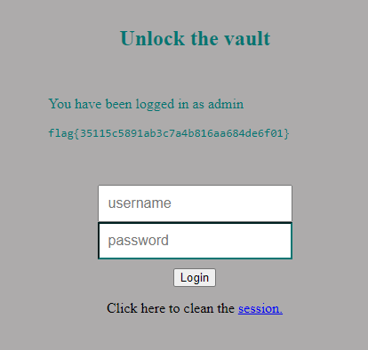

# Challenge 2

In this second part of the CTF, we didn't have access to the code, so we started by analysing possible vulnerabilities according to the features of the platform. 

The platform contains not only an authentication feature, as one that allows any user, without the need to be logged in, to check the network status (nice GIF!) and to ping a host, which takes the host itself from a user input.

This way, to ping a host, the common command in linux, if is that the one that's being used, is 'ping'. If that's the case, then we have an opportunity to manipulate the input in order to run a command line instruction to see the contents of the file 'flag.txt', since the 'ping' command will run with those permissions.

The strategy to achieve that is to make sure the 'ping' command is closed and the 'cat' one is used right after to read the content of /flag.txt, as we did: 

```
;cat /flag.txt
```

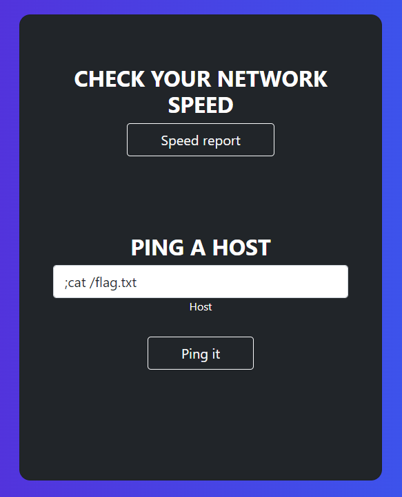

With this, we got our final flag of this CTF:

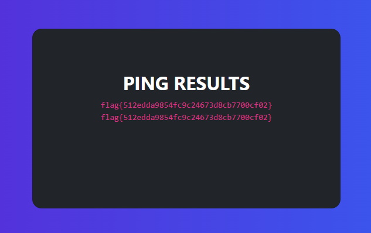

